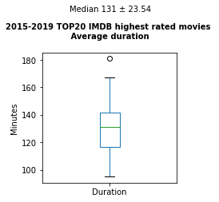
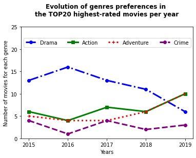
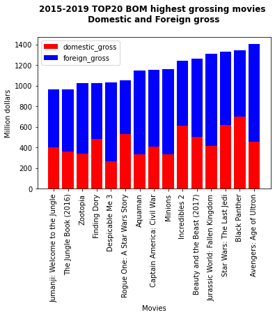
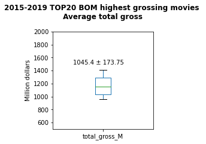
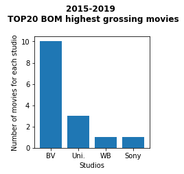
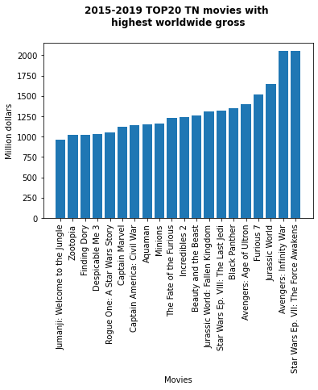
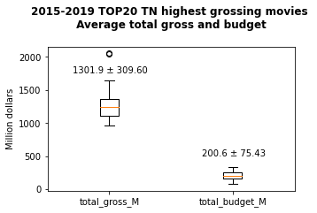
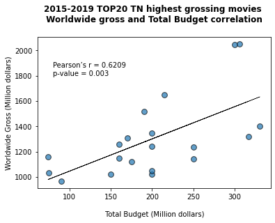
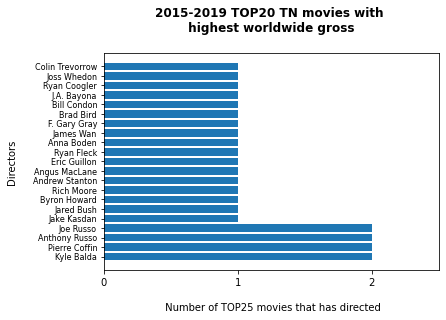

# MICROSOFT NEW STUDIO CREATION

**Authors**: Ariadna Recasens

## Overview

Microsoft has decided to start a new film studio, but lack expertise in the field. In this project, we will explore different datasets obtained from 3 online databases of information related to film and provide insights to help Microsfot create top ranking movies. 

## Business Problem

Microsoft wants to explore the trending of creating original video content and has decided to create a new movie studio. Still, there is a complete lack of expertise in the field. This case study will provide actionable insights to help the head of Microsoft's new movie studio decide what type of films to create.
***
Some of the questions that we will consider are:
* What films are currently doing the best at the box office?
* What do they have in common (e.g. genre?)
* Who is behind their production? 
* In which studios where they created? 
* What was their budget?
***

## Data

This case study will explore data provided by some of the most reliable and well-know online database of information related to film:
* [IMDB](https://www.imdb.com/)
* [The Numbers](https://www.the-numbers.com/)
* [Box Office Mojo](https://www.boxofficemojo.com/)


***
In particular, we will use the following datasets:
* imdb.title.basics.csv.gz: 146144 entries with the following information: tconst, primary_title, original_title, start_year, runtime_minutes, genres.
* imdb.title.ratings: 73856 entries with the following information: tconst, averagerating, numvotes.
* imdb.name.basics.csv.gz: 606648 entries with the following information: nconst, primary_name, birth_year,  death_year, primary_profession, known_for_titles
* imdb.title.crew.csv.gz: 146144 entries with the following information: tconst, directors, writers.
* tn.movie_budgets.csv.gz: 5782 entries with the following information: id, release_date, movie, production_budget, domestic_gross, worldwide_gross.
* bom.movie_gross.csv.gz: 3387 entries with the following information: title, studio, domestic_gross, foreign_gross, year

Based on the questions provided in the business problem, the variable that we will focus are:
* Average ratings
* Total gross
* Studios that produced the top movies 
* Directors involved in top movies
* Budget

***

## Methods

To know what are the films that are doing the best, we will create top 20 list with the best movies. After exploring our available datasents and understanding which information we have available, we will create lists based on:

* **Ratings**: using IMDB datasets
* **Total gross**: using TN and BOM datasets


We want to focus on recent movies, so we will only select the past 5 years movies. The data collected in our datasets cover films from up to 2019, so we will set our range between 2015-2019. 

Furthermore, we will set up a minium of votes (at least 25,000 following the IMDB guidelines) to make our list more reliable.

Since we want to create lists based on rating and total gross, we will omit the raws that have no values in those fields. 

We will use these list to gain insights and help Microsoft to create a succesfull new film studio. 


## Results


### 2015-2019 TOP20 IMDB highest rated movies 


### Duration average of the 2015-2019 TOP20 IMDB highest rated movies 


### Most common genres of the 2015-2019 TOP20 IMDB highest rated movies 


### Evolution of genres preference between 2015-2019 for the TOP20 IMDB highest rated movies 


### 2015-2019 TOP20 BOM highest grossing movies 


### Gross average of the  2015-2019 TOP20 BOM highest grossing movies 


### Studios that created the 2015-2019 TOP20 BOM highest grossing movies 


### 2015-2019 TOP20 TN highest grossing movies 


### Total gross and budget average of the 2015-2019 TOP20 TN highest grossing movies 


### Total gross and budget correlation of the 2015-2019 TOP20 TN highest grossing movies 


### Directors behing the 2015-2019 TOP20 TN highest grossing movies 



## Evaluation

In this project, we have created 3 lists:
- Top20 iMDB highest rated movies
- Top20 TN highest grossing movies
- Top20 BOM highest grossing movies

Summary of the main findings:
* Average duration of highest-rated movies is 131.0 minutes ± 23.54 minutes.
* Most common genres in top20 IMDB highest rated movies between 2015-2019 are Drama, Action, Adventure, Crime. 
* The preference for drama is declining; Action and Adventure are increasing; and Crime reamins stable.
* The studies that created the top20 highest rating movies are BV, Uni, Sony, WB and Fox.
* The top20 TN highest grossing movies had a production budget average of \\$200.6M ± \\$75.43M.
* There is a signficant correlation (p < 0.05) between budget and worldwide gross.
* The directors behing the top20 highest grossing movies are: Pierre Coffin, Anthony Russo, Joe Russo, Jake Kasdan, Jared Bush, Byron Howard, Rich Moore, Andrew Stanton, Angus MacLane, Eric Guillon, Ryan Fleck, Anna Boden, James Wan, F. Gary Gray, Brad Bird, Bill Condon, J.A. Bayona, Ryan Coogler, Joss Whedon, Colin Trevorrow.


Evaluation: the top20 TN and top20 BOM lists provide similar results, which is an indicative of the robustness of our case-study. 

The fact that we used datasets from 3 different resources (BOM, TN, IMDB) containg large amounts of data increase the conficence of our results.  


## Conclusions

We provide the following business recomendations:

* The duration of the movies to be produced by Microsoft studio whould be around 131.0 minutes ± 23.54 minutes. 
* The new Microsoft movies should classified as Action, Adventure, Drama and/or Crime.
* The new Microsoft movies should have the following studios as references: BV, Uni, Sony, WB and Fox.
* The new Microsoft movies should have an available production budget of \\$200.6M ± \\$75.43M.
* The new Microsoft studio should contact some of the following directors: Pierre Coffin, Anthony Russo, Joe Russo, Jake Kasdan, Jared Bush, Byron Howard, Rich Moore, Andrew Stanton, Angus MacLane, Eric Guillon, Ryan Fleck, Anna Boden, James Wan, F. Gary Gray, Brad Bird, Bill Condon, J.A. Bayona, Ryan Coogler, Joss Whedon, Colin Trevorrow.

Further steps: to analyze the datasets containing the critics comments. We can gain more insights by knowing what the experts in the field (the critics)think. We can also do some studies based on regions, to create movies targeting those countries. 

## For More Information

Please review our full analysis in [our Jupyter Notebook](./dsc-phase1-project-template.ipynb) or our [presentation](./DS_Project_Presentation.pdf).

For any additional questions, please contact **Ariadna & ari.reca@gmail.com**

## Repository Structure

Describe the structure of your repository and its contents, for example:

```
├── README.md                           <- The top-level README for reviewers of this project
├── dsc-phase1-project-template.ipynb   <- Narrative documentation of analysis in Jupyter notebook
├── DS_Project_Presentation.pdf         <- PDF version of project presentation
├── data                                <- Both sourced externally and generated from code
└── images                              <- Both sourced externally and generated from code
```
